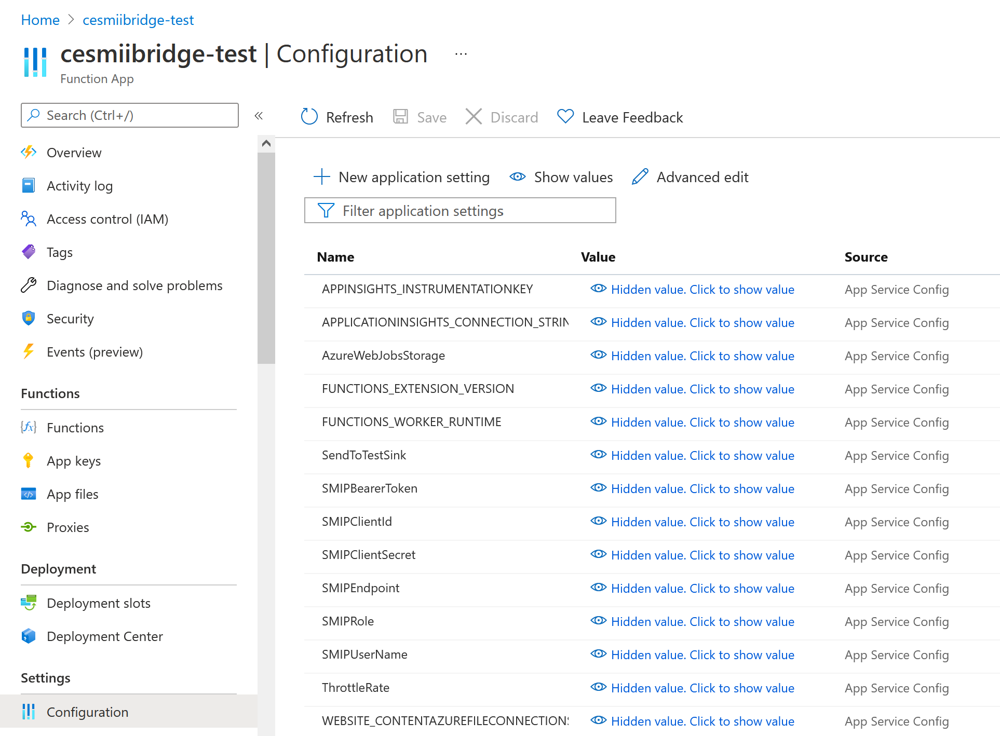

# SPSEventGridFunction
Azure Function to get Telemetry from an Event Grid and push it to the SMIP

## Example Telemetry Payload

An Event Grid pushes this telemetry that arrived on the IOT Hub
```
{
  "body": {
    "fields": {
      "ActiveEnergy": 67120.921875,
      "ActivePowerL1": 12.110038,
      "ActivePowerL2": 0,
      "ActivePowerL3": 0,
      "ActivePowerTotal": 12.110038,
      "ApparentPowerL1": 23.909693,
      "ApparentPowerL2": 0,
      "ApparentPowerL3": 0.50649,
      "ApparentPowerTotal": 23.909693,
      "CurrentL1": 0.1048,
      "CurrentL2": 0,
      "CurrentL3": 0,
      "Flow1": 0,
      "Flow2": 0,
      "Flow3": 0,
      "Frequency": 50.038342,
      "Pressure1": 0.047183,
      "Pressure2": 0,
      "Pressure3": 0.030568,
      "ReactivePowerL1": -16.74004,
      "ReactivePowerL2": 0,
      "ReactivePowerL3": 0,
      "ReactivePowerTotal": -16.74004,
      "VoltageL1": 228.1465,
      "VoltageL2": 228.038528,
      "VoltageL3": 227.964096
    },
    "comId": "3S7PN6J3XR0",
    "creationTimeUtc": "2021-11-15T20:43:28.062Z",
    "deviceId": "3S7PN6J3XR0",
    "messageType": "IOTGW-RT"
  },
  "enqueuedTime": "Mon Nov 15 2021 15:43:28 GMT-0500 (Eastern Standard Time)",
  "properties": {}
}
```

# Moving Data to SMIP

Each element in a telemetry payload corresponds with an equipment instance's attribute in the SMIP.

Each equipment instance is derived from an Equipment Type definition in the SMIP.

The Equipment Type definition is a (hand-made, for now) mirror of the OPC UA Information Model (Nodeset) from the physical piece of equipment. See `OriginalNodesets` for details about source data.

In this demonstrator, the physical equipment published OPC UA data to IOT Hub. IOT Hub raises an Event Grid any time a new payload (telemetry) is received. 
This Azure function gets called with that payload, finds the matching attribute ID in the SMIP for each element, and pushes a GraphQL mutation to update the SMIP. See the dataMap at the bottom of `EventGridSMIPTransfer.cs` for an example of how the mapping is made.

This is hugely inefficient, and is therefore throttled.

# Debugging

Debugging is difficult, so this project can use a helper web server (a "test sink") to get real-time copies of what is being done. The helper web server should log HTTP POST requests, see the file `testpost.php` for an example.

# Configuring

To avoid including SMIP secrets in the code, you can use either local.settings.config or the Azure Function configuration to store GraphQL authentication information. See `local.settings-example.config` for a template.



See [https://docs.microsoft.com/en-us/azure/azure-functions/functions-how-to-use-azure-function-app-settings](https://docs.microsoft.com/en-us/azure/azure-functions/functions-how-to-use-azure-function-app-settings) for more details