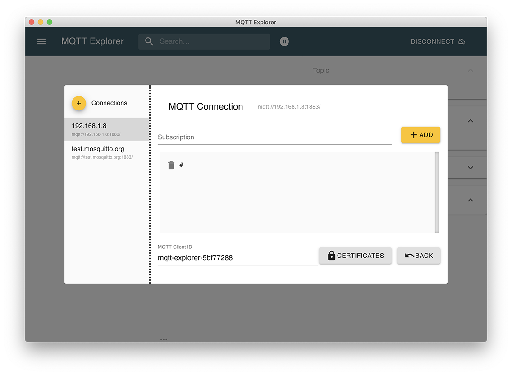
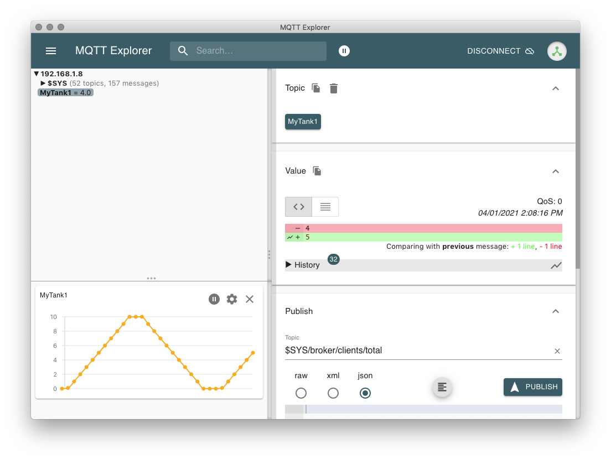

# Install
* Requires Python3
* Requires Paho-MQTT, pynput and sympy:

```
sudo pip3 install paho-mqtt
sudo pip3 install pynput
sudo pip3 install sympy
```

* Modify line 8 to point to your MQTT Broker

# Simulator 
The simulator is intended to act like an independent process unit, emitting data over MQTT about its current state.

## Config
* Copy `config-example.py` to `config.py`
* Specify the MQTT section to match your Broker

## Run
`python3 simulate.py [simulation-file] [`*optional*` simulation-type][`*optional*` current_flow] [`*optional*` current_flow2] [`*optional*` set_fill] [`*optional*` set_leak]`
* **simulation-file**: name of simulation config file to use, no extension. eg: tank
* **simulation-type**: the kind of simulation to perform, defaults to stepwise
  * stepwise: publishes each line of the config in a loop with a delay
  * random: determines the lowest and highest number in the config and publishes a random number in that range in a loop with a delay
  * randomfill: fills in the tank at a random flow rate, the flow rate changes every 5 rounds
  * randomleak: leaks the tank till it's empty at a random flow rate, the flow rate changes every 5 rounds
  * fillandleak: fills in the tank while it leaks, takes in optional current_flow as the fill rate, and current_flow as the leak rate
  * fill: fills in the tank until it reaches set_fill if provided, takes in optional parameters current_flow as the fill rate and set_fill as the designated volume
  * leak: fills in the leak until it reaches set_leak if provided, takes in optional parameters current_flow as the leak rate and set_leak as the designated volume
  * functionchange: fill level changes like the input math function trend line
  * normalflow: creates fill level flows based on the tanks innitiation in config

  

* **topic-name**: same as the simulation-file for simulations of onetank; for multitanks simulations, topic names are Mytank0-Mytank6
* **current_flow**: the current flow rate of fill or leak
* **current_flow2**: used in the case of fillandleak, current_flow is the fill rate and current_flow2 is the leak rate
* **set_fill**: the final volume that the tank is filled up to, current_flow has to be provided to use the parameter
* **set_leak**: the final volume where the leaking stops, current_flow has to be provided to use the parameter

### Examples:
run with python3 gateway.py -m onetank:
* `python3 simulate.py tank`
* `python3 simulate.py tank functionchange "math.sin(2t)"`
* `python3 simulate.py tank fill 1.0 20.0`
* `python3 simulate.py tank leak 1.0 2.0`
* `python3 simulate.py tank fillandleak 2.0 0.5`
* `python3 simulate.py tank random`
* `python3 simulate.py tank randomfill`
* `python3 simulate.py tank randomleak`

run with python3 gateway.py -m multitanks
* `python3 simulate.py tank normalflow`
(during simualtion: type 'leak' to triger a leak in tank1, and type 'cavitation' to triger a cavitation in tank1)

### Test on SMIP:
To test and see the trend lines on our platform:
* 1. `python3 gateway.py -m onetank/multitanks` on a terminal
* 2. add pens under "attribute trending" on our platform
* 3. run one of the above example on another terminal
* 4. `python3 gateway.py -m clean` will clear all the tanks


### Notes:
You can run multiple instances, but make sure they each have a unique topic on the Broker!

## Test
* Use an app like [MQTT Explorer](http://mqtt-explorer.com/)
* Subscribe to the `#` topic in the Advanced settings

* Connect to the Broker, and watch the data come in


## Stop

```
control + c
```

# Gateway
The Gateway functions as a "connector" from MQTT to the SM Innovation Platform, pumping data from a simulator to the Platform.

## Config
* Uses same config.py as Simulator, but update the SMIP section to match your GraphQL Authenticator.
* Update line 16 to match the Attribute id to update in the SMIP
  * Hard-coding is sad. We need to query for and/or create the equipment instance, then find the attribute to update programmatically.

## Run

```
python3 gateway.py -m onetank (for simulations of one tank)
python3 gateway.py -m multitanks   (for simulations of multiple tanks)

```

# Mosquitto
Eclipse Mosquitto is an open source (EPL/EDL licensed) message broker that implements the MQTT protocol versions 5.0, 3.1.1 and 3.1. Mosquitto is lightweight and is suitable for use on all devices from low power single board computers to full servers.

## [Mosquitto Debian repository for Raspberry Pi](https://mosquitto.org/blog/2013/01/mosquitto-debian-repository/) (currently Pi 3 B+)
After following these steps, Mosquitto will automatically be started on boot and available at `:1883`.

* To use the new repository you should first import the repository package signing key:

```
wget http://repo.mosquitto.org/debian/mosquitto-repo.gpg.key  
sudo apt-key add mosquitto-repo.gpg.key  
```

* Then make the repository available to apt:

```
cd /etc/apt/sources.list.d/
```

* Then one of the following, depending on which version of debian you are using:

```
sudo wget http://repo.mosquitto.org/debian/mosquitto-jessie.list  
sudo wget http://repo.mosquitto.org/debian/mosquitto-stretch.list  
sudo wget http://repo.mosquitto.org/debian/mosquitto-buster.list  
```

* Then update apt information:

```
apt-get update
```

* Install Mosquitto and Mosquitto-Clients

```
apt-get install mosquitto mosquitto-clients
```

* For v2+: Create Mosquitto configuration file. All listeners now require authentication to be configured. This is with the exception of the case where no listener configuration is provided and hence the listener is bound to the loopback interface and will start in local only mode allowing only connections from clients running on the local machine. This means that `allow_anonymous` now defaults to `false`. If you currently have a broker running that has a listener configured in the configuration file, but has no other authentication configured and no explicit `allow_anonymous` setting, then your clients will be unable to connect after upgrading to Mosquitto 2.0.
For ease of setup, the following configuration is allowing anonymous connections. For other authentication options see [https://mosquitto.org/documentation/authentication-methods/](https://mosquitto.org/documentation/authentication-methods/).

```
cd /etc/mosquitto/
sudo cp conf.d/default.conf conf.d/anon.conf
sudo vi conf.d/anon.conf
```

Update the `anon.conf` to the following:

```
listener 1883
allow_anonymous true
```

* Install Uncomplicated Firewall to allow port 1883 outside of the Rasberry Pi

```
apt-get install ufw
```

* Enable the firewall

```
ufw enable
```

* Allow port 1883

```
ufw allow 1883
```

## Start the Mosquitto Broker using a configuration file from 

```
sudo mosquitto -c /etc/mosquitto/mosquitto.conf
```

## Start the Mosquitto Broker using a configuration file in background mode
```
sudo mosquitto -c /etc/mosquitto/mosquitto.conf -d
```

## Testing the Mosquitto Server

* Start the command line subscriber:

```
mosquitto_sub -v -t 'test/topic'
```

* Publish test message with the command line publisher:

```
mosquitto_pub -t 'test/topic' -m 'helloWorld'
```

Both the subscriber and publisher connection messages should be seen in the broker terminal and the 
following should be seen in the subscriber terminal:

```
test/topic helloWorld
```

## Data Flow
```
client (running python example code) > broker (mosquitto) > client (MQTT Explorer)
```
