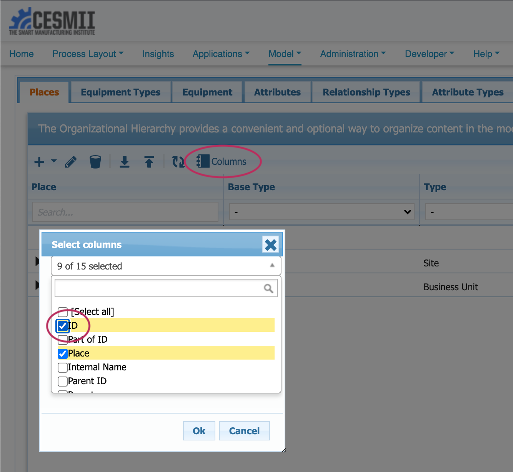

# SMIP Mutations

In GraphQL, the endpoint is always the same, but the query payload changes to indicate the response payload you wish to retrieve. Updates and Insertions are called Mutations, and are performed against the same endpoint as queries. For more information on accessing the GraphQL endpoint for your SMIP instance, see the page [SMIP GraphQL Endpoint](smip-graphql.md).

## Finding IDs

In these examples, you need to know the ID of the element you are mutating. You can find IDs through [GraphQL Queries](queries.md), but it is also available in the UI by turning on the ID column in any table view:




## Example Mutations

### Mutating Time Series Sample Values

The following query payload mutates time series sample values for a given Instance Attribute Tag, with the provided time stamp. If values already exist, they will be updated (replaced). If values did not previously exist, they will be inserted:

```
mutation MyTimeSeriesMutation {
  replaceTimeSeriesRange(
    input: {
      attributeOrTagId: "##"
      entries: [
        { timestamp: "2021-02-02T02:00:00Z", value: "1.5", status: "1" }
        { timestamp: "2021-02-02T03:00:00Z", value: "2.5", status: "1" }
        { timestamp: "2021-02-02T04:00:00Z", value: "3.5", status: "1" }
      ]
      startTime: "2021-02-02"
      endTime: "2021-02-03"
    }
  ) {
    clientMutationId
    json
  }
}
```

Replace ## with your tag or attribute ID.

### Creating New Tags

```
mutation CreateTag_Mutation {
  createTag(
    input: {
      tag: {
        dataType: FLOAT
        relativeName: "NewTagName"
        displayName: "NewTagName"
        partOfId: "##"
      }
    }
  ) {
    clientMutationId
    tag {
      id
      displayName
      systemType
    }
    asThing {
      id
      displayName
      systemType
    }
  }
}
```

Replace ## with the ID of the connector you want to attach the tag to.

### Creating New Equipment
  
  ```
  mutation MyNewEquipmentMutation {
  createEquipment(
    input: {
      equipment: {
        displayName: "Batch Machine 001"
        description: "My machine based on a batch tank type definition"
        partOfId: "1362"
        relativeName: "batch_machine_001"
        typeId: "358"
      }
    }
  ) {
    equipment {
      id
      displayName
    }
  }
}
```
### Creating Relationships Between Equipment

```
mutation CreateRelationshipMutation {
  createRelationship(
    input: {relationship: {
      subjectId: "5184", 
      typeName: "relationship", 
      relationshipTypeName: "can_feed", 
      objectId: "5166", 
      relationshipTypeId: "874",
      description: "equipment with ID 5184 can feed equipment with ID 5166"}}
  ) {
    relationship {
      id
    }
  }
}
```

## <a name="authentication">Authentication Mutations</a>

If your token has expired, getting a new one is a two step process where you request a challenge, then respond to the challenge:

### Authentication Challenge

```
mutation get_challenge {
  authenticationRequest(
    input: {
      authenticator: "cesmiidemoauthenticator"
      role: "demo_owner"
      userName: "cesmiiloginname"
    }
  ) {
    jwtRequest {
      challenge
      message
    }
  }
}
```

1. authenticator: This is same as "Authenticator Name" you created on this page: https://<yourinstance>.cesmii.net/developer/graphql-authenticator

2. role: This is same as "Roles" you created on this page https://<yourinstance>.cesmii.net/developer/graphql-authenticator

3. userName:  This is the same as your login name for https://<yourinstance>.cesmii.net/


### Authentication Challenge Response

```
mutation get_token {
  authenticationValidation(
    input: {
      authenticator: "cesmiidemoauthenticator"
      signedChallenge: "f13bc155e5233f26ef4e1dc45eeded2f|authenticatorpasswd"
    }
  ) {
    jwtClaim
  }
}
```

1. authenticator: This is same as "Authenticator Name" you created on this page: https://_yourorg_.cesmii.net/developer/graphql-authenticator

2. signedChallenge: This is the same as "challenge": "ca6df09059e7b68a9e07b8cdae95b937" output from get_challenge.  This string needs to be appended with "|_authenticatorpasswd_".  

_authenticatorpasswd_ is same as the one you used when you created the authenticator 

## Other Operations

Read only operations, called Queries, are performed against the same endpoint. Some  [Query examples can be found here](queries.md).
